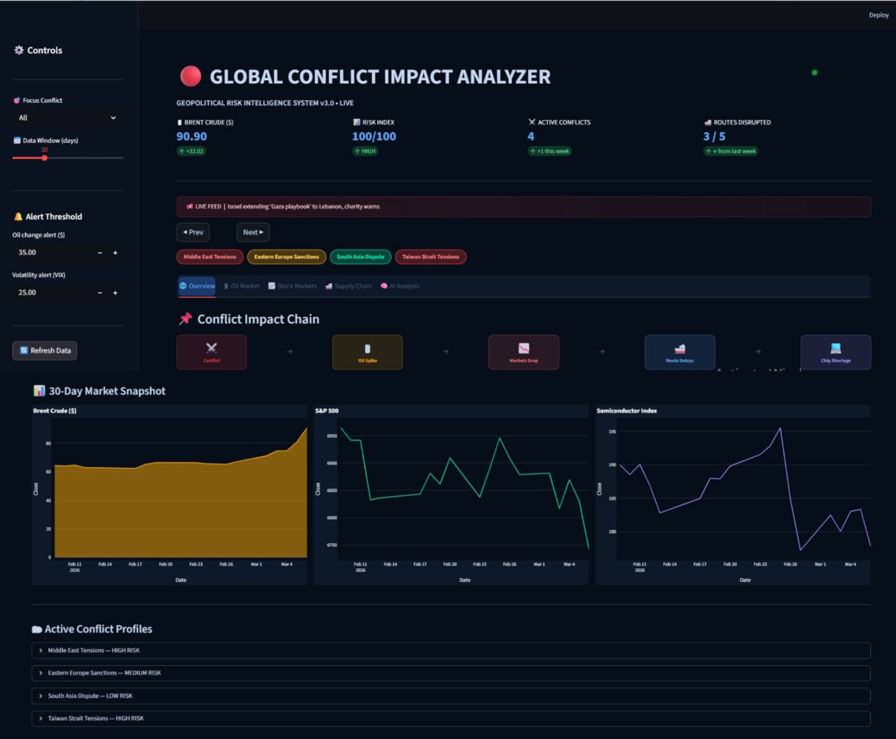
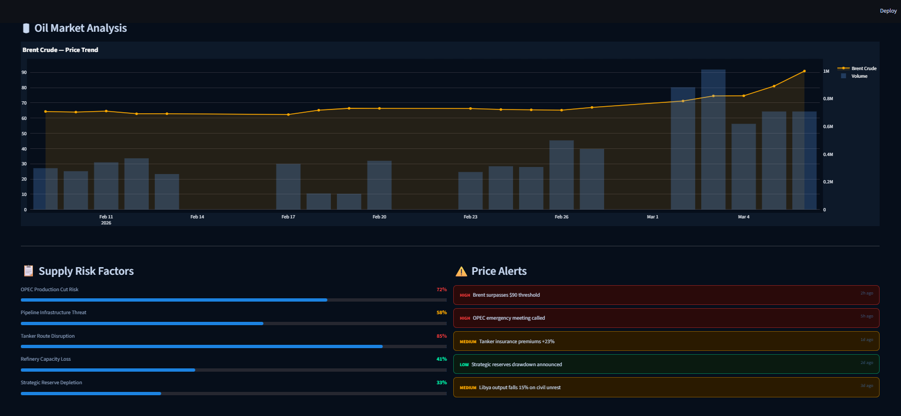
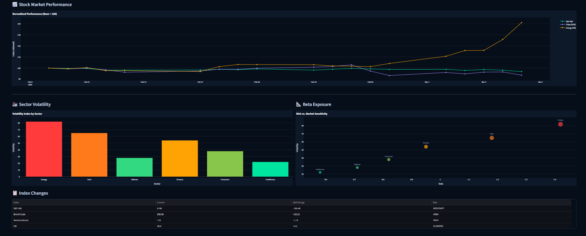
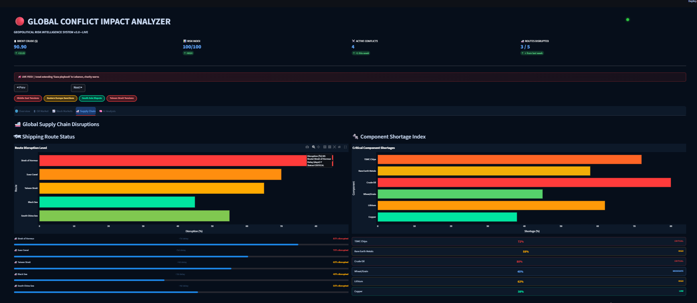
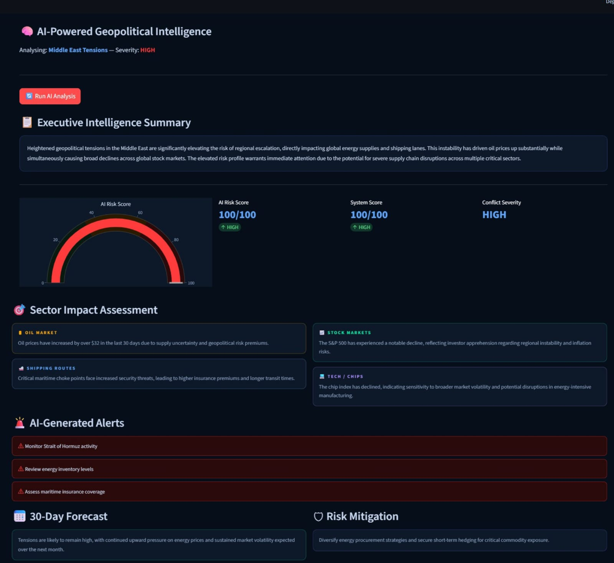

# 🌍 Global Conflict Impact Analyzer

> AI-powered geopolitical risk intelligence dashboard that tracks how global conflicts affect financial markets and supply chains in real-time.


---

## 📌 Overview

A real-time geopolitical risk intelligence system that analyzes how global conflicts
impact critical economic sectors. Built with Python, Streamlit, and Google Gemini AI.

### Conflict Impact Chain
```
⚔️ Conflict → 🛢 Oil Spike → 📉 Markets Drop → 🚢 Route Delays → 💻 Chip Shortage
```

---

## 🚀 Features

- 📊 **Real-time market data** via yfinance (Oil, S&P 500, Semiconductors)
- 🧠 **AI-powered analysis** using Google Gemini (gemini-flash-lite-latest)
- 📈 **Interactive Plotly charts** with dark theme
- ⚠️ **Risk scoring system** (0-100) based on market changes
- 📢 **Conflict news feed** (filtered — no irrelevant news)
- 🗺 **Shipping route disruption tracker**
- 💻 **Semiconductor supply chain monitor**
- 5 analysis tabs: Overview, Oil Market, Stock Markets, Supply Chain, AI Analysis

---

## 🛠 Tech Stack

| Technology | Purpose |
|---|---|
| Python 3.10+ | Core language |
| Streamlit | Dashboard UI |
| Plotly | Interactive charts |
| yfinance | Market data |
| Google Gemini AI | Intelligence reports |
| pandas / numpy | Data processing |
| NewsAPI | Conflict news feed |
| python-dotenv | API key management |

---

## 📁 Project Structure
```
Global_Conflict_Analyzer/
├── dashboard/
│   └── app.py                 # Main Streamlit dashboard
├── scripts/
│   ├── data_collection.py     # Data fetching script
│   ├── ai_model.py            # AI model logic
│   ├── analysis.py            # Data analysis functions
│   └── fix_csv.py             # CSV fixing utility
├── data/
│   ├── oil_prices.csv         # WTI crude oil data
│   ├── sp500_data.csv         # S&P 500 index data
│   ├── chip_data.csv          # Semiconductor index
│   └── conflict_news.csv      # News headlines
├── .gitignore
├── README.md
└── requirements.txt

---

## ⚙️ Setup & Installation

### 1. Clone the repository
```bash
git clone https://github.com/YOUR_USERNAME/global-conflict-impact-analyzer.git
cd global-conflict-impact-analyzer
```

### 2. Install dependencies
```bash
pip install -r requirements.txt
```

### 3. Create `.env` file
Create a `.env` file in the project root:
```
GEMINI_API_KEY=your_gemini_api_key_here
NEWS_API_KEY=your_newsapi_key_here
```

Get your free API keys:
- Gemini API → https://aistudio.google.com
- NewsAPI → https://newsapi.org

### 4. Collect market data
```bash
python scripts/data_collection.py
```

### 5. Run the dashboard
```bash
streamlit run dashboard/app.py
```

Open your browser at `http://localhost:8501` 🚀

---

## 📊 Dashboard Tabs

| Tab | Description |
|---|---|
| 🌐 Overview | Conflict impact chain + 30-day market snapshot |
| 🛢 Oil Market | Brent crude price trend + supply risk factors |
| 📈 Stock Markets | Normalised index performance + sector volatility |
| 🚢 Supply Chain | Shipping route disruptions + component shortages |
| 🧠 AI Analysis | Gemini AI intelligence report + risk gauge |

---

## 🔑 API Keys Required

| API | Free Tier | Link |
|---|---|---|
| Google Gemini | ✅ Free | https://aistudio.google.com |
| NewsAPI | ✅ Free (100 req/day) | https://newsapi.org |

---

## 🧠 How AI Analysis Works

1. Collects real market data (oil change, S&P change, chip index)
2. Computes risk score (0-100) using weighted formula
3. Sends data to Google Gemini AI
4. Gemini returns structured JSON report with:
   - Executive summary
   - Sector impact assessment
   - 30-day forecast
   - Risk mitigation recommendation
   - AI-generated alerts

---

## 📄 License

MIT License — feel free to use, modify and share.

---

## 👤 Author

Built by **Fatima Muzafar Ali** — Computer System Engineering Student  
🔗 GitHub:https://github.com/fatima-muzafar
💼 LinkedIn: https://www.linkedin.com/in/fatima-muzafar-ali-900a172a0

## 📸 Screenshots

### 🏠 Main Dashboard


### 🛢 Oil Market Analysis


### 📈 Stock Markets


### 🚢 Supply Chain


### 🧠 AI Analysis
